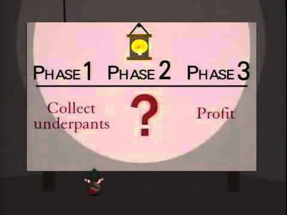

- title : F# v produkci
- description : F# v produkci
- author : David Podhola
- theme : night
- transition : default

***

### F# v produkci - FSharping vol. 3

- David Podhola
- @davidpodhola, @FakeCRM
- david.podhola@naseukoly.cz
- http://david.podhola.net

***

### Agenda

- Naučit se F#
- ???
- PROFIT

***

### Co zajímavého děláme v F#

- sync.today
- fs2cs
- fakta
- Fable
- yo fsharp 

***

### Jak jsem se k F# dostal?

- útěk od špatně navrženého multithreadového C# kódu
- původně cca 500.000 řádků, 70 tříd
- nakonec 30.000 řádků v F# s větší funkčností

***

### Je F# skutečně tak složitý?

- není složitý, je jiný
- zapomeňte, jak jste to dělali do teď
- vzdělejte se

***

### Co používáme - FSharp.Data.SqlClient

- Compile time kontrola F# i T-SQL kódu
- výkon (versus LINQ)
- podpora v design time

***

### Co používáme - Orleankka (actor) & Suave (http)

- funkcionální nadstavba na Microsoft Orleans
- actor model v F# (nikoliv v C#)
- web server v F#

***

### Co používáme - WebSharper (generátor HTML a JS )

- profesionální a dostupné řešení
- vše v F#
- používá vlastní backend

***

### Co používáme - Fable (F# -> JS tranpiler)

- inspirace FunScriptem
- pro kompilaci FSharp.Compiler.Service
- pro generování Babel

***

### Co používáme - fs2cs (F# -> C# tranpiler)

- negeneruje shodný kód, na to je dotPeek
- použitelný ve specifických případech
- inspirovaný Fable
- pro generování Roslyn

***

### Díky za pozornost

- David Podhola
- @davidpodhola, @FakeCRM
- david.podhola@naseukoly.cz
- http://david.podhola.net

***
