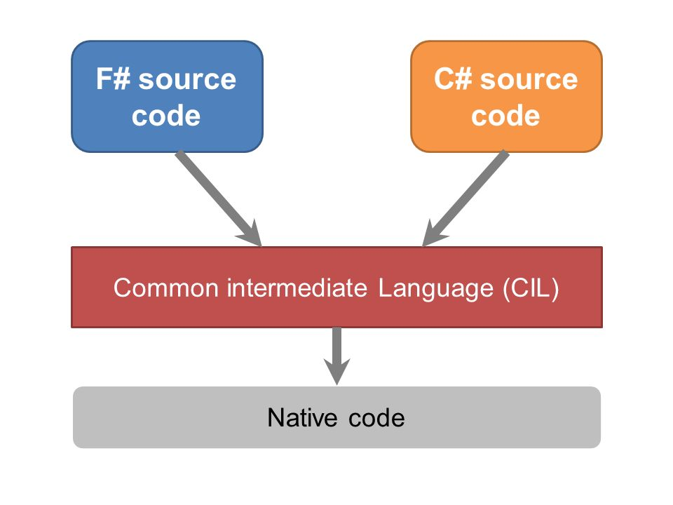

- title : F# <-> C# interop
- description : F# <-> C# interop
- author : Jindřich Ivánek
- theme : black
- transition : default

***

##Jindřich Ivánek

## F# <-> C# interop
jindra.ivanek@gmail.com

@jindraivanek

***

online F# coding

* **DotNetFiddle** https://dotnetfiddle.net/
* **HackerRank** https://www.hackerrank.com
* **CodinGame** https://www.codingame.com

***

##Jindřich Ivánek

## F# <-> C# interop
jindra.ivanek@gmail.com

@jindraivanek

---

##Jindřich Ivánek

## MSPS
Matematické a statické projekty a software, s.r.o.

---

##AristoTelos

http://www.aristotelos.cz

---

##Optimalizace směn

` `|C#|F#
--|--|--
projektů|22|13
souborů|312|46
{ nebo }|4878|37
prázdný|2648|1040
výskyt null|314|5
komentáře|2863|767
"užitečné" řádky|10587|7033
**celkem**|**21290**|**8882**

***

***

## Použití C# knihoven z F#

---

## Funkce a metody

###C#
    [lang=cs]
    bool Method(string name, long count, float weight)

###F#
    Method: (string * int64 * float32) -> bool

	let x = ("foo", 1L, 0.2) |> Method

---

##Anonymní Funkce

    open System.Linq
    [1..10].Where(fun x -> x % 2 = 0)

---

##Type inference
    open System.Linq

    let evens xs = xs |> Seq.filter (fun i -> i%2=0)
    let evensLinq (xs:seq<_>) = xs.Where(fun i -> i%2=0)

	let sd = System.Collections.Generic.SortedDictionary<_,_>([1,"foo"; 2,"goo"] |> dict)

---

## out parametry

    public static bool TryParse(String s, out Int32 result)

    let success, result = "42" |> System.Int32.TryParse

---

## optional parametry

	type OptionalParams() =
		static member Method(?x: int, ?printIt: bool) =
			let x = defaultArg x 0
			let printIt = defaultArg printIt false
			if printIt then printfn "%i" x
			x

	OptionalParams.Method
    OptionalParams.Method(42)
    OptionalParams.Method(42,true)

---

## setters

###C#
	[lang=cs]
	public class Class
    {
        public int Field1 { get; set; }

        public string Field2 { get; set; }

	}

###F#
	let x = Class(Field1 = 12, Field2 = "ahoj")

---

## setters

###C#
	[lang=cs]
	public class Class
    {
        public int Field1 { get; set; }

        public string Field2 { get; set; }

        public Class(int x)
        {
            Field1 = x;
        }
	}

###F#
	let x = Class(12, Field2 = "ahoj")

---

##Základní typy

C#|F#|F# literal
--|--|--
string|string|`"foo"`
bool|bool|`true`
int|int|`1`
long|int64|`1L`
float|float32|`1.0f`
double|float|`1.0`

---
##Základní typy

    type seq<'a> = IEnumerable<'a>

	[| 1..10 |] : int[]

	[ 1.. 10 ] : list<int>, FSharpList<int>

	Some(1) : option<int>, FSharpOption<int>
---

##Základní typy

	[lang=cs]
	var o = OptionModule.OfObj("foo");
    var o2 = FSharpOption<int>.Some(1);

    var l = ListModule.OfArray(ArrayModule.Create(10, 0));

---

## dictionary

    let d: IDictionary<_,_> = ["foo", 1; "goo", 2] |> dict
    d |> Seq.map (fun kvp -> kvp.Key, kvp.Value)

(ExtCore) Dict module

	let d2 = d |> Dict.add "hoo" 3

	match d2 |> Dict.tryFind "joo" with
    | None -> printfn "Nope"
    | Some x -> printfn "%i" x

---

## null value

http://latkin.org/blog/2015/05/18/null-checking-considerations-in-f-its-harder-than-you-think/

	isNull : value:'T -> bool when 'T : null
    Option.ofObj : value:'T -> 'T option when 'T : null
    Option.toObj : value:'T option -> 'T when 'T : null

    Unchecked.defaultOf<'T> : 'T

---

### vyjímky
	let divide1 x y =
		try
			Some (x / y)
		with
		| :? System.DivideByZeroException -> printfn "Division by zero!"; None

    (ExtCore) Option.attempt : generator:(unit -> 'T) -> 'T option

---

## Object Expressions

    let makeResource name =
		{ new System.IDisposable
			with member this.Dispose() = printfn "%s disposed" name }

https://fsharpforfunandprofit.com/posts/object-expressions/

---

## Object Expressions

    {new Arbitrary<LongSet>() with
        override x.Generator =
		    Gen.listOf Arb.generate<int64> |> Gen.map LongSet
        override x.Shrinker t = Seq.empty }

---

## `[<CLIMutable>]`

Redis example

***

##Použití F# knihoven z C#

---

##Multiparametrické funkce
###F#
    module Module =
        let plus x y = x + y

###C#
    [lang=cs]
    public static class Module
    {
        public static int plus(int x, int y);
    }

---

##Func vs FSharpFunc    
    [lang=cs]
    var xs = SeqModule.Map<int, int>(
      FSharpFunc<int,int>.FromConverter(x => x * 2), new int[] { 0, 1 });

---

##Func vs FSharpFunc    
    [lang=cs]
    var xs = SeqModule.Map<int, int>(
      FSharpFunc<int,int>.FromConverter(x => x * 2), new int[] { 0, 1 });

	Func<int, int> f = x => x * 2;
    var xs2 = SeqModule.Map(f.ToFSharpFunc(), new int[] { 0, 1 });

---

##Func vs FSharpFunc    
    [lang=cs]
    var xs = SeqModule.Map<int, int>(
      FSharpFunc<int,int>.FromConverter(x => x * 2), new int[] { 0, 1 });

	Func<int, int> f = x => x * 2;
    var xs2 = SeqModule.Map(f.ToFSharpFunc(), new int[] { 0, 1 });

	var xs3 = SeqModule.Map(Fun.Fun<int,int>(x => x*2), new int[] { 0, 1 });

***

## F# datové struktury

---

## Records

### F#
    type Record = { Name: string; Age: int }

---

### C#
    [lang=cs]
    public sealed class Record : IEquatable<Record>, IStructuralEquatable
        , IComparable<Record>, IComparable, IStructuralComparable
    {
        public Record(string name, int age);

        public int Age { get; }
        public string Name { get; }

        public sealed override int CompareTo(Record obj);
        public sealed override int CompareTo(object obj);
        public sealed override int CompareTo(object obj, IComparer comp);
        public sealed override bool Equals(Record obj);
        public sealed override bool Equals(object obj);
        public sealed override bool Equals(object obj, IEqualityComparer comp);
        public sealed override int GetHashCode();
        public sealed override int GetHashCode(IEqualityComparer comp);
    }

---

## Discriminated unions
### F#
    type DU =
        | Case1
        | Case2 of string

---

### C#

    [lang=cs]
    public abstract class DU : IEquatable<DU>, IStructuralEquatable
        , IComparable<DU>, IComparable, IStructuralComparable
    {
        public static DU Case1 { get; }
        public bool IsCase1 { get; }
        public bool IsCase2 { get; }
        public int Tag { get; }

        public static DU NewCase2(string item);

        public static class Tags
        {
            public const int Case1 = 0;
            public const int Case2 = 1;
        }
        public class Case2 : DU
        {
            public string Item { get; }
        }

---

### C#

    [lang=cs]
        public sealed override int CompareTo(DU obj);
        public sealed override bool Equals(DU obj);
        public sealed override bool Equals(object obj);
        public sealed override bool Equals(object obj, IEqualityComparer comp);
        public sealed override int GetHashCode();
        public sealed override int GetHashCode(IEqualityComparer comp);
    }

---

http://fsharpforfunandprofit.com/posts/fsharp-decompiled/

ukázka kódu

***

## Extension metody

    [<Extension>]
    type FSharpFuncUtil =

        [<Extension>]
        static member ToFSharpFunc<'a,'b> (func:System.Converter<'a,'b>) =
			fun x -> func.Invoke(x)

        [<Extension>]
        static member ToFSharpFunc<'a,'b> (func:System.Func<'a,'b>) =
			fun x -> func.Invoke(x)

        [<Extension>]
        static member ToFSharpFunc<'a,'b,'c> (func:System.Func<'a,'b,'c>) =
			fun x y -> func.Invoke(x,y)

        [<Extension>]
        static member ToFSharpFunc<'a,'b,'c,'d> (func:System.Func<'a,'b,'c,'d>) =
			fun x y z -> func.Invoke(x,y,z)

---

## Typový alias
Pouze pro F#.

---

## Measure types
Pouze pro F#.

---

## Implicitní konverze
demo

---

## Implicitní konverze

* F# nepodporuje implicit (úmyslně)
* implicit metody existují
    static member op_Implicit
* lze napsat metodu op_Implicit, která bude fungovat na straně C#

***

## Kam dál
https://fsharpforfunandprofit.com/series/object-oriented-programming-in-fsharp.html

## Sources
https://blogs.msdn.microsoft.com/jaredpar/2010/07/27/converting-system-funct1-tn-to-fsharpfuncttresult/
http://stackoverflow.com/questions/1686895/is-there-an-equivalent-to-creating-a-c-sharp-implicit-operator-in-f

***

## THE END

Slides: http://jindraivanek.gitlab.io/fsharping-interop

Source code: https://gitlab.com/jindraivanek/fsharping-interop
