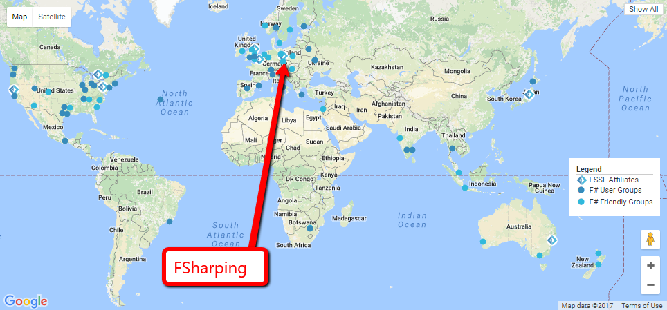

- title : Type Providers
- description : FSharping #9 - Type Providers
- author : Roman Provaznik
- theme : night
- transition : none


***************************************************************************************************

# FSharping #9
## Type Providers


<br/><br/><br/><br/><br/><br/><br/>
### Roman Provazník

[@dzoukr](https://twitter.com/dzoukr) | [@fsharping](https://twitter.com/fsharping) | [fsharping.com](https://fsharping.com)

***************************************************************************************************

## **#fsharping**

## **fsharping.slack.com**


***************************************************************************************************

<section data-background-color="white">
   
</section>


***************************************************************************************************

## Announcement **#1**

-----------------------------------------


-----------------------------------------

## We got the<br/>**new kid** on the block!

-----------------------------------------

## Honza Břešťan

<table><tr><td class="table-leftcol">


</td><td class="table-rightcol">

NCR C#/**F#** developer

F# enthusiast

Now **official member** of FSharping

Make ATMs **side-effects free** again!

</td></tr></table>

***************************************************************************************************

## Announcement **#2**

-----------------------------------------

## There are **75** F# friendly user groups worldwide

-----------------------------------------

## **8** out of **75** are official<br/>**F# Software Foundation** Affiliated user groups

-----------------------------------------

DC F# Meetup - USA

San Franciso F# User Group - USA

F# |> Cambridge - UK

F# Paris - France

F# Sydney - Australia

F#unctional Toronto - Canada

F#談話室 - Japan

-----------------------------------------

DC F# Meetup - USA

San Franciso F# User Group - USA

F# |> Cambridge - UK

F# Paris - France

F# Sydney - Australia

F#unctional Toronto - Canada

F#談話室 - Japan

**FSharping - Czech Republic**

-----------------------------------------



-----------------------------------------

## What does it mean for FSharping?

Official **promo** from F# Foundation

**Costs coverage** from F# Foundation

**Swag** (stickers, t-shirts, ...)

+1000 Hipster XPs **:)**

-----------------------------------------

## What we need to do?

Move from Srazy.info to **Meetup.com**

New address: **meetup.com/FSharping**

... and that\`s all

-----------------------------------------

## ...and now about<br/> **Type Providers**

***************************************************************************************************

## Type Providers

Component that provides **types**, **properties**, and **methods** from **various data sources** for use in your program

-----------------------------------------
## Type Providers

Code generator that lives **inside F# compiler**

Used at **edit-time** to generate entire type systems for you to work with as **you type**

-----------------------------------------

## Type Providers

Killer feature of F#

Available since version 3.0

Not available for .NET Core (until .NETStandard 2.0)

-----------------------------------------


VS

```fsharp
type MyXYZProvider = MyXYZProvider<SomeSettings>
MyXYZProvider.GeneratedType
MyXYZProvider.GeneratedMethod()
```

-----------------------------------------

## Two types of TP

<table><tr><td class="table-leftcol">

**Generative**

generates real .NET types behind cover

can be consumed from C#

</td><td class="table-rightcol">

**Erasing**

most of F# type providers

generates "fake" types (replaced during compilation)

contain delayed members (nested types and properties) -> could potentially represent infinite information space

can be consumed from F# only

</td></tr></table>

-----------------------------------------

## There are **plenty of TP**

Json, Xml, Html, Csv, Sql, Swagger, Excel, Resource files, Config files...


-----------------------------------------

## How do they work?


See: <a href="http://blog.mavnn.co.uk/type-providers-from-the-ground-up/">Type Providers From the Ground Up</a>

***************************************************************************************************

## **DEMO** (TP in action)